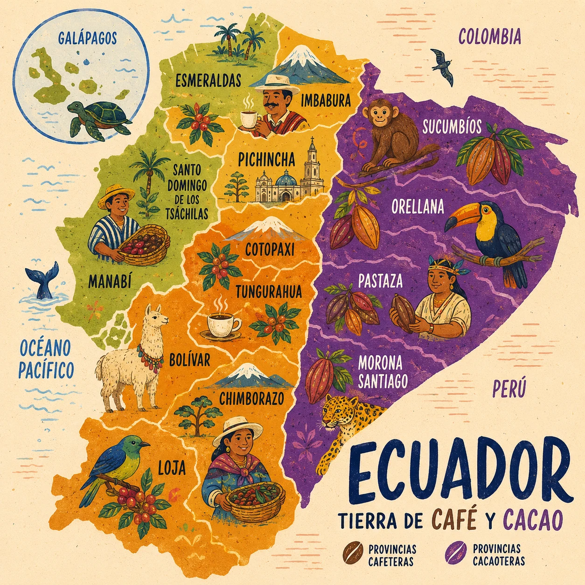

# COFFEE GOLDEN

<p align="center">
  
</p>

<p align="center">
  <strong>Experiencia web que conecta cada producto de café y cacao ecuatoriano con su origen, su historia y una comunidad de consumidores mediante códigos QR, trazabilidad y recompensas.</strong><br>
  Escanea. Descubre. Acumula. Disfruta.
</p>

---

## Integrantes

| Integrante | Rol |
|---|---|
| Sofía Torres | Líder del proyecto |
| Luana Herrera | Diseño UI/UX |
| Icari Vásconez | Investigación |
| Ian Rodríguez | Especialista en operaciones |
| Evelyn Cando | Mentora y asesora |

---

## Problema Que Se Quiere Resolver

El consumo de café y cacao forma parte de la identidad productiva del Ecuador, pero para muchos consumidores la experiencia termina en la compra. Generalmente no existe una conexión clara con el origen del producto, las comunidades productoras, el proceso de cultivo, el tostado o la transformación del cacao.

Los emprendimientos también necesitan herramientas digitales accesibles para comunicar el valor de sus productos, fortalecer la confianza del cliente y generar fidelización sin depender de aplicaciones móviles complejas.

## Solución Propuesta

**Coffee Golden** es una experiencia web que conecta el producto físico con un pasaporte digital mediante un código QR. El usuario escanea el empaque y accede directamente a una página donde puede conocer la historia del lote, explorar territorios productores de café y cacao, acumular Coffee Coins y comprar productos en sobres filtrantes.

La plataforma combina identidad ecuatoriana, educación sobre el origen, comercio digital y gamificación en una web adaptable para computadoras y teléfonos.

## Cómo Funciona

| Paso | Proceso |
|---|---|
| 1 | El usuario encuentra un código QR en el empaque Coffee Golden. |
| 2 | Al escanearlo, el QR abre directamente el pasaporte web del producto. |
| 3 | El pasaporte muestra origen, finca, proceso, nivel de tostado, notas y lote. |
| 4 | El usuario explora el mapa interactivo de territorios cafeteros y cacaoteros del Ecuador. |
| 5 | Cada compra y escaneo permite acumular **Coffee Coins**. |
| 6 | Los puntos pueden convertirse en descuentos, promociones y productos. |
| 7 | El usuario agrega productos al carrito y registra su pedido desde la misma web. |

## Productos

| Producto | Descripción |
|---|---|
| Sobre filtrante | Café de grano seleccionado en un filtro portátil, listo para preparar sobre una taza. |
| Caja Coffee Golden | Presentación con varios sobres individuales para casa, oficina o regalo. |
| Combo Golden | Sobres filtrantes, galletas artesanales y acceso al pasaporte cafetero QR. |

## ODS Vinculados

| ODS | Nombre | Aplicación En Coffee Golden |
|---|---|---|
| ODS 8 | Trabajo Decente y Crecimiento Económico | Visibiliza el trabajo de productores y fortalece emprendimientos vinculados al café y cacao. |
| ODS 9 | Industria, Innovación e Infraestructura | Digitaliza la experiencia del producto mediante QR, trazabilidad y comercio web. |
| ODS 12 | Producción y Consumo Responsables | Promueve decisiones de compra informadas y una mayor comprensión del origen del producto. |

## Tecnologías

| Categoría | Tecnología |
|---|---|
| Frontend | HTML5, CSS3 y JavaScript modular |
| Diseño | Figma y diseño web adaptable |
| Datos de respaldo | localStorage |
| Base de datos preparada | Firebase Firestore |
| Integración física-digital | Códigos QR y pasaporte de producto |
| Gamificación | Coffee Coins y recompensas |
| Hosting | GitHub Pages |
| Control de versiones | GitHub |

## Funcionalidades Principales

| Módulo | Descripción |
|---|---|
| Portada QR | Confirma el lote escaneado y presenta la historia del producto. |
| Pasaporte Cafetero | Muestra origen, finca, proceso, tostado, notas y código de lote. |
| Mapa Interactivo | Presenta provincias referenciales de café, cacao y biodiversidad del Ecuador. |
| Coffee Coins | Visualiza el saldo y explica cómo obtener recompensas. |
| Catálogo | Presenta productos con fotografías, precios y Coffee Coins generados. |
| Carrito y Pedido | Permite seleccionar productos, calcular el total y registrar información de entrega. |
| Firestore | Guarda y consulta pedidos cuando Firebase está configurado. |
| Modo Local | Mantiene la demostración funcional con localStorage cuando Firebase no está configurado. |

## Arquitectura De La Plataforma

```text
Código QR del producto
        |
        v
GitHub Pages / index.html
        |
        +-- Pasaporte del lote
        +-- Mapa de café y cacao
        +-- Coffee Coins
        +-- Catálogo y carrito
        |
        v
Firebase Firestore
        |
        +-- Colección de compras
        +-- Lectura de pedidos recientes
```

## Mapa De Café Y Cacao

<p align="center">
  
</p>

El mapa funciona como una guía cultural referencial. Cada punto interactivo presenta la región, el producto principal y una breve descripción del territorio. No representa un ranking absoluto de calidad.

## Impacto Esperado

- Acercar a los consumidores a la historia del café y cacao ecuatoriano.
- Visibilizar territorios, productores y procesos de transformación.
- Fortalecer la confianza mediante información clara del producto.
- Facilitar la venta digital de sobres filtrantes Coffee Golden.
- Incentivar la fidelización mediante Coffee Coins.
- Promover un consumo informado y responsable.

---

## MVP Web

[Abrir Coffee Golden](https://vivca22.github.io/COFFEE-GOLDEN/)

## Video Demo

[Ver video de Coffee Golden en Instagram](https://www.instagram.com/reel/DZsc8pOxtmR/?igsh=MXBzM3puaXk0NTBwbg==)

## Estructura Del Proyecto

```text
COFFEE-GOLDEN/
|-- index.html
|-- styles.css
|-- script.js
|-- firebase-config.js
|-- README.md
`-- assets/
    |-- logo-emblema.webp
    |-- hero-origen-v2.webp
    |-- mapa-ecuador-provincias.webp
    |-- sobre-filtrante.webp
    |-- caja-sobres.webp
    `-- combo-golden.webp
```

## Configuración De Firebase

1. Crear un proyecto en [Firebase Console](https://console.firebase.google.com/).
2. Registrar una aplicación web.
3. Activar Firestore Database.
4. Copiar la configuración pública de Firebase.
5. Reemplazar los valores de ejemplo dentro de `firebase-config.js`.

No se deben subir claves privadas, credenciales de servicio ni secretos de servidor al repositorio.

## Despliegue En GitHub Pages

La publicación se realiza desde:

```text
Settings -> Pages -> Deploy from a branch -> main -> /(root)
```

La aplicación queda disponible en:

https://vivca22.github.io/COFFEE-GOLDEN/

---

<p align="center">
  <strong>Coffee Golden</strong><br>
  Brillo, origen y calidad en cada experiencia.
</p>
